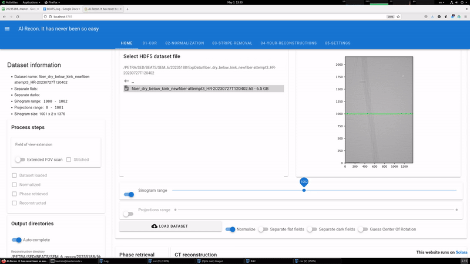
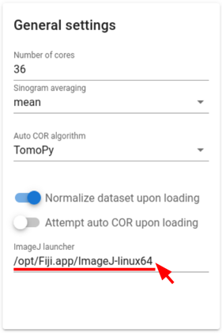

# Alrecon (الريكُن)
Pure Python Computed Tomography reconstruction web application. Built with [Solara](https://solara.dev/).

[](https://github.com/gianthk/alrecon/blob/master/LICENSE)
[](https://zenodo.org/doi/10.5281/zenodo.10535211)



### How to cite
If you use `alrecon` please cite:
>  Iori et al., (2024). Alrecon: computed tomography reconstruction web application based on Solara. Open Research Europe, 4(54). https://doi.org/10.12688/openreseurope.16863.2  <br>

## Installation
<!-- Install `alrecon` using pip. The flag `[all]` will install optional dependencies required for integration with [`napari`](https://napari.org) and logging to google spreadsheets.
```commandline
pip install alrecon[all]
``` -->

1. Checkout this repository:
```commandline
git clone https://github.com/gianthk/alrecon.git
```
2. Navigate to the repository and create a virtual environment with all necessary dependencies:
```commandline
cd alrecon
conda env create --file envs/alrecon-base.yml
conda activate alrecon-base
```
> [!NOTE]
> If you already have a destination virtual environment for alrecon, you can install manually the requirements listed in file [alrecon.yml](envs/alrecon-base.yml).

> [!NOTE]
> You can install [Miniconda](https://docs.anaconda.com/free/miniconda/index.html) if you have conda not on your computer and have no desire for a "fully-fledged" anaoonda environment (to date, the tomopy package is only available for conda). There is an option for a "Quick command line install", which runs the complete installation without having you to click. In case of doubt, you can omit the last step `~/miniconda3/bin/conda init bash` and activate conda by `source miniconda3/bin/activate`.

> [!NOTE]
> To use TomoPy with CUDA features, install TomoPy from conda following [these instructions](https://tomopy.readthedocs.io/en/stable/install.html).

3. Build the `alrecon` app:
```commandline
pip install -e .
```

## Usage
### Run the `alrecon` [solara](https://solara.dev/api/file_browser) web application on your localhost
```commandline
solara run alrecon.pages --host localhost
```
### Run `alrecon` within [jupyter](https://solara.dev/api/file_browser)
1. Make sure that the `alrecon` virtual environment is activated and `ipykernel` installed:
```commandline
conda activate alrecon
pip install --user ipykernel
```
or:
```commandline
conda install -c anaconda ipykernel 
```
2. Install [ipykernel](https://github.com/ipython/ipykernel) with the `alrecon` virtual environment:
```commandline
python -m ipykernel install --user --name=alrecon
```
3. Launch Jupyter Notebook or Jupyter Lab instance:
```commandline
jupyter lab
```
4. Open and run the cells of the notebook [launch_within_jupyter.ipynb](launch_within_jupyter.ipynb). [](launch_within_jupyter.ipynb)

You can take a look at [solara's documnetation](https://solara.dev/api) for more information on the different ways of running solara applications.

---
## Integration with Google Sheets
- `Alrecon` allows you to keep a consistent log of all reconstruction jobs on an online master Google spreadsheet.
- The integration uses [gspread](https://docs.gspread.org/en/v5.12.0/), a Python API for Google Sheets.
- You will need to set up your Google Cloud account, enable [Google Sheets API](https://developers.google.com/sheets/api/guides/concepts), and create a Secret Key with read/write permission to your online master Google sheet. Follow [these instructions](https://www.youtube.com/watch?v=hyUw-koO2DA) to setup the integration with Google Sheets API.

### How it works
1. Set up your Google Cloud account and a Secret Key with read/write permissions as described above
2. Save your Secret Key and modify the alrecon settings file with the path to your Secret Key file
3. Create or upload to your Google account a spreadsheet master. You can find a template in `resources/foo_master.xls`
4. If the option `log to google master spreadsheet` is activated, each time you submit a job to the HPC cluster the reconstruction settings are logged as a new line of the master spreadsheet

### HPC cluster integration
`Alrecon` can generate reconstruction job files and submit them to the workers of a cluster, if this is available. The current integration assumes that the [slurm workload manager](https://slurm.schedmd.com/quickstart.html) is available on the host, and is designed for the [ID10-BEATS beamline](https://www.sesame.org.jo/beamlines/beats) of SESAME. Here are some general instructions on how to set up alrecon to work with your HPC facility:

- The `remote_user` specified in the alrecon settings file must exist and have `ssh` access to the `remote_host`
- [`slurm`](https://slurm.schedmd.com/quickstart.html) must be installed and running on the host
- Slurm job file creation is handled by the `slurm.py` module in `alrecon/components`
- An example slurm `.job` file is available in `resources/foo.job`
- At ID-10 BEATS, we use a Python script named `BEATS_recon.py` to perform complete [TomoPy](https://tomopy.readthedocs.io/en/stable/) reconstruction pipelines. The script is available on the [BEATS_recon](https://github.com/SESAME-Synchrotron/BEATS_recon/tree/master/scripts/rum) repository. A copy of the script is in this repository in `resources/BEATS_recon.py`.
- The `recon_script` specified in the settings file must contain the full path to your reconstruction script (`BEATS_recon.py` in our case). This must be accessible by the host. 
- To adapt alrecon to a different reconstruction script or command:
    - Start by taking a look at the `slurmjob` class in `alrecon/components/slurm.py`
    - Create a new set_recon_command method following the example of `set_recon_command_beats`

## Use with [napari](https://napari.org/stable/)
[napari](https://napari.org/stable/) is a powerful pure Python multi-dimensional image viewer. Alrecon supports napari only when [running the app through Jupyter](#run-al-recon-within-jupyter).

## Setup [ImageJ](https://imagej.net/software/fiji/) launcher
To launch [ImageJ](https://imagej.net/software/fiji/) from the alrecon web app follow these steps:
1. Modify the path to your ImageJ executable in the alrecon general settings


2. Copy the [FolderOpener_virtual.ijm](/imagej_macros/FolderOpener_virtual.ijm) ImageJ macro contained in `/alrecon/imagej_macros/` to the plugin folder of your ImageJ installation. On Linux this is something like `/opt/Fiji.app/macros/`.

## Acknowledgements

This project has received funding from the European Union’s Horizon 2020 research and innovation programme under grant agreement No [[822535]](https://cordis.europa.eu/project/id/822535)(Beamline for Tomography at SESAME [BEATS](https://beats-sesame.eu/)). 
